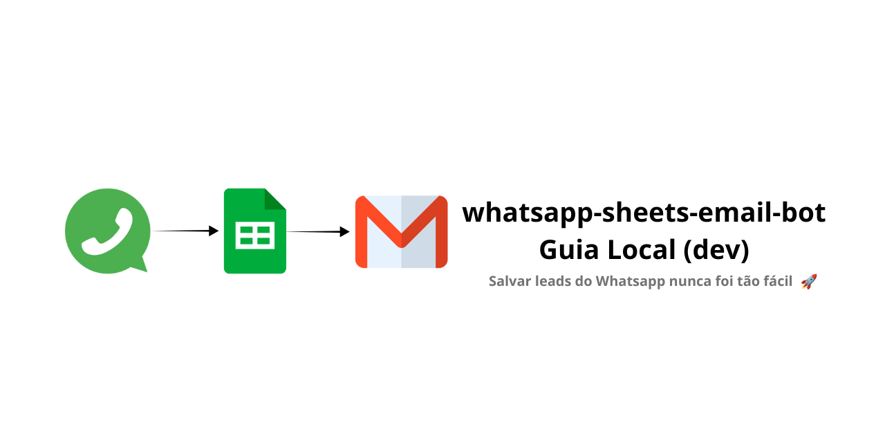
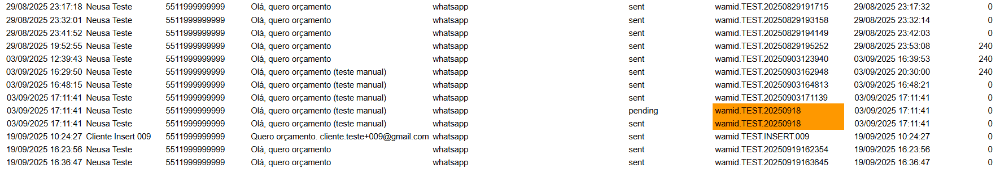

<!-- Language Switch -->
<p align="center">
  <a href="./README.en.md">
    
  </a>
  <a href="./README.md">
    
  </a>
</p>

<!-- Project Banner -->
<p align="center">
  
</p>

<!-- Divider ABOVE badges -->
<hr/>

<!-- Tech Badges (BELOW divider) -->
<p align="center">
  
  
  
  
  
  
  
  
  
</p>

---

## 📑 Table of Contents

- [🔗 Useful Links](#useful-links)
- [🎥 Demo](#demo)
- [⚡ Quickstart](#quickstart)
- [🔄 Visual Flow](#visual-flow)
- [🧱 Project Structure](#project-structure)
- [✅ Requirements](#requirements)
- [🔐 .env Configuration](#env-configuration)
- [🧪 Layered Tests](#layered-tests)
- [🌐 Flask Webhook (WhatsApp Cloud API)](#flask-webhook)
- [🧠 Anti-duplicates](#anti-duplicates)
- [✉️ Email with “Reply on WhatsApp” button](#email-whatsapp)
- [🧯 Common Issues](#common-issues)
- [🧩 Useful Commands](#useful-commands)
- [🗺️ Roadmap](#roadmap)
- [📜 License](#license)
- [👩‍💻 Author & Contact](#author-contact)

---

<a id="useful-links"></a>
## 🔗 Useful Links

- **📊 Demo Sheet (view-only):** [Google Sheets](https://docs.google.com/spreadsheets/d/1SQ56Wes-9d54ahjK04furxZm4PViW2-Q3RLm-sJuqAE/edit?usp=sharing)  
- **📘 Deploy Docs:** [./docs/DEPLOY.md](./docs/DEPLOY.md)  
- **⚙️ Example config:** [./.env.example](./.env.example)

> **Note:** This sheet only contains fictitious data for testing and demo purposes. No real customer or contact info was used.

---

<a id="demo"></a>
## 🎥 Demo
<details open>
<summary>Click to watch the demo</summary>

<p align="center">
  
</p>
</details>

**What the GIF shows:** a test lead is sent via `/webhook`, automatically inserted into the `leads` sheet, `updated_at` is populated, and `diff_minutos = 0`.  
**Extra visuals:** duplicate **WAMID** highlighted in orange and date validation on **updated_at**.

---

<a id="quickstart"></a>
## ⚡ Quickstart
### Activate environment
- **Windows (CMD):** `.venv\Scripts\activate`  
- **Windows (PowerShell):** `& ".\.venv\Scripts\Activate.ps1"`  
- **Linux/Mac:** `source .venv/bin/activate`  

### Install dependencies
`pip install -r requirements.txt`

### Run basic scripts
- Setup sheet: `python scripts/setup_sheet.py`  
- Append lead: `python scripts/append_lead.py`  
- Append + send email: `python scripts/append_and_notify.py`  

### Run webhook
`python scripts/webhook.py`  
- Healthcheck: `http://localhost:5000/` → `OK`  
- Endpoint: `http://localhost:5000/webhook`  

### Open tunnel (ngrok)
`ngrok http 5000` → use the public URL in Meta Developers  

---

<a id="visual-flow"></a>
## 🔄 Visual Flow
📱 WhatsApp (client message) → 🌐 Flask Webhook (Meta event) → 📊 Google Sheets (save lead & update status) → ✉️ Email (auto-send to team) → 📝 Logs + Anti-duplicates (monitoring & prevention)  

---

<a id="project-structure"></a>
## 🧱 Project Structure (expected)
whatsapp-sheets-email-bot/  
├─ .env  
├─ .env.example  
├─ creds/  
│  └─ service-account.json  
├─ data/  
│  └─ state.db                  # auto-created (anti-duplicates)  
├─ logs/  
│  └─ app.log                   # webhook logs  
├─ scripts/  
│  ├─ setup_sheet.py  
│  ├─ append_lead.py  
│  ├─ send_email.py  
│  ├─ append_and_notify.py  
│  ├─ dedupe.py  
│  └─ webhook.py  
└─ .venv/                       # virtual environment  

---

<a id="requirements"></a>
## ✅ Requirements
- Python 3.10+  
- Google Account + **Google Cloud** with:  
  - **Google Sheets API** and **Google Drive API** enabled  
  - **Service Account** (downloaded JSON file)  
- **WhatsApp Cloud API** account in Meta Developers  
- **App password** for Gmail (SMTP) or Mailtrap credentials  

---

<a id="env-configuration"></a>
## 🔐 `.env` Configuration
File: [./.env.example](./.env.example)

```ini
# App / Server
ENV=dev
HOST=127.0.0.1
PORT=5000
TZ=America/Sao_Paulo
LOG_LEVEL=INFO

# Google Sheets
SHEET_ID=1SQ56Wes9d54ahjK04furxZm4PViW2-Q3RLm-sJuqAE
SHEET_TAB=leads
GOOGLE_SERVICE_ACCOUNT_JSON=./creds/service-account.json
SHARE_WITH_EMAIL=whatsapp.bot.teste@gmail.com

# Email (SMTP / Gmail)
EMAIL_ENABLED=0
SMTP_HOST=smtp.gmail.com
SMTP_PORT=587
SMTP_STARTTLS=1
SMTP_USER=your_email@gmail.com
SMTP_PASS=YOUR_APP_PASSWORD
EMAIL_FROM=your_email@gmail.com
EMAIL_TO=recipient@example.com
EMAIL_SUBJECT=New WhatsApp lead

# Meta Webhook
VERIFY_TOKEN=my-super-secret-verification
WHATSAPP_TOKEN=EAAGxxxxxxxxxxxxxxxxxxxxxxxx

# Local Tests
TEST_BASE_URL=http://127.0.0.1:5000
TEST_FROM=5511999999999
TEST_NAME=Maria Teste
TEST_BODY=Hello, I want a quote
```

---

<a id="layered-tests"></a>
## 🧪 Layered Tests

- **Sheets — create tab & headers:** `python scripts/setup_sheet.py` → Expected: ✅ Sheet OK!  
- **Sheets — insert lead manually:** `python scripts/append_lead.py` → Expected: ✅ Lead added  
- **Email — insert & send:** `python scripts/append_and_notify.py` → Expected: 📧 Email sent!

---

<a id="flask-webhook"></a>
## 🌐 Flask Webhook (WhatsApp Cloud API)

- **Start local server:** `python scripts/webhook.py`  
- **Open HTTPS tunnel (ngrok):** `ngrok http 5000`  
- **Configure in Meta (Developers):**  
  - Webhook URL: `https://abc123.ngrok.io/webhook`  
  - Verify Token: same as `.env`  
  - Webhook Fields → `messages`  

### 🔍 Tests
- **GET with curl** → should return challenge  
- **POST with sample payload** → creates new lead in Sheets + email sent  
- **Logs** → visible in terminal and in `logs/app.log`

---

<a id="anti-duplicates"></a>
## 🧠 Anti-duplicates

- Implemented in `scripts/dedupe.py` via SQLite (`data/state.db`)  
- Uses WhatsApp **wamid** as key  
- Default **TTL = 24h**  
- Repeated messages are ignored  

---

<a id="email-whatsapp"></a>
## ✉️ Email with “Reply on WhatsApp” button

- Includes button: `https://wa.me/55XXXXXXXXXXX`  
- Supports logo via `.env` variable: `EMAIL_LOGO_URL`

---

<a id="common-issues"></a>
## 🧯 Common Issues

- **403 (Sheets API disabled)** → enable Sheets + Drive in Google Cloud  
- **SpreadsheetNotFound** → share sheet with service account email  
- **SMTP failure** → use Gmail app password or Mailtrap credentials  
- **ngrok not accessible** → run Flask before `ngrok http 5000`

---

<a id="useful-commands"></a>
## 🧩 Useful Commands

- **Activate env:**  
  `.venv\Scripts\activate` (Windows CMD) / `& ".\.venv\Scripts\Activate.ps1"` (PowerShell) / `source .venv/bin/activate` (Linux/Mac)  

- **Scripts:**  
  `python scripts/setup_sheet.py`, `python scripts/append_lead.py`, `python scripts/append_and_notify.py`, `python scripts/webhook.py`  

- **Logs:**  
  `type .\logs\app.log` (Windows) / `cat ./logs/app.log` (Linux/Mac)

---

<a id="roadmap"></a>
## 🗺️ Roadmap

- Active replies on WhatsApp  
- Anti-duplicate filter by phone + time window  
- Deploy (Railway/Render/VPS)  
- Simple HTML dashboard  

**Current Status:** ✅ Sheets OK | ✅ Email OK | ✅ Webhook ready | ✅ Anti-duplicates | ✅ Logs 

---

<a id="license"></a>
## 📜 License

This project is under the [MIT License](./LICENSE).  

---

<a id="author-contact"></a>
## 👩‍💻 Author & Contact

**Author:** [NeusaM21](https://github.com/NeusaM21)  
**Contact:** [contact.neusam21@gmail.com](mailto:contact.neusam21@gmail.com)

---

<p align="left">
  <a href="https://github.com/NeusaM21">
    
  </a>
</p>

