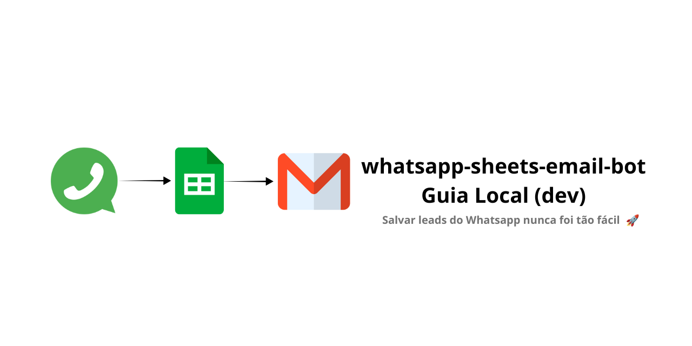

<p align="center">
  
</p>

<p align="center">
  
  
  
  
  
  
  
  
  
</p>

---

## 🔗 Links úteis
- **📊 Planilha demo (view-only):** [Google Sheets](https://docs.google.com/spreadsheets/d/1SQ56Wes-9d54ahjK04furxZm4PViW2-Q3RLm-sJuqAE)
- **📘 Docs de deploy:** [./docs/DEPLOY.md](./docs/DEPLOY.md)
- **⚙️ Exemplo de configuração:** [./.env.example](./.env.example)

---

## ⚡ Guia rápido
### Ativar ambiente
- **Windows (CMD):** `.venv\Scripts\activate`
- **Windows (PowerShell):** `& ".\.venv\Scripts\Activate.ps1"`
- **Linux/Mac:** `source .venv/bin/activate`

### Instalar dependências
`pip install -r requirements.txt`

### Rodar scripts básicos
- Setup planilha: `python scripts/setup_sheet.py`
- Adicionar lead: `python scripts/append_lead.py`
- Adicionar + enviar e-mail: `python scripts/append_and_notify.py`

### Rodar webhook
`python scripts/webhook.py`  
- Healthcheck: `http://localhost:5000/` → `OK`  
- Endpoint: `http://localhost:5000/webhook`

### Abrir túnel (ngrok)
`ngrok http 5000` → use a URL pública no Meta Developers

---

## 🔄 Fluxo visual resumido
📱 WhatsApp (mensagem do cliente) → 🌐 Webhook Flask (recebe evento do Meta) → 📊 Google Sheets (salva lead e atualiza status) → ✉️ E-mail (envio automático para equipe) → 📝 Logs + Anti-duplicados (monitoramento e prevenção)

---

## 🧱 Estrutura do projeto (esperada)
whatsapp-sheets-email-bot/  
├─ .env  
├─ .env.example  
├─ creds/  
│  └─ service-account.json  
├─ data/  
│  └─ state.db                  # criado automaticamente (anti-duplicados)  
├─ logs/  
│  └─ app.log                   # logs do webhook  
├─ scripts/  
│  ├─ setup_sheet.py  
│  ├─ append_lead.py  
│  ├─ send_email.py  
│  ├─ append_and_notify.py  
│  ├─ dedupe.py  
│  └─ webhook.py  
└─ .venv/                       # ambiente virtual  

---

## ✅ Pré-requisitos
- Python 3.10+
- Conta Google + **Google Cloud** com:
  - **Google Sheets API** e **Google Drive API** habilitadas
  - **Service Account** (arquivo JSON baixado)
- Conta **WhatsApp Cloud API** no Meta Developers
- **Senha de app** no Gmail (para SMTP) ou credenciais do Mailtrap

---

## 🔐 Configuração do `.env`

Arquivo: [./.env.example](./.env.example)

```ini
# App / Server
ENV=dev
HOST=127.0.0.1
PORT=5000
TZ=America/Sao_Paulo
LOG_LEVEL=INFO

# Google Sheets
SHEET_ID=1SQ56Wes9d54ahjK04furxZm4PViW2-Q3RLm-sJuqAE
SHEET_TAB=leads
GOOGLE_SERVICE_ACCOUNT_JSON=./creds/service-account.json
SHARE_WITH_EMAIL=whatsapp.bot.teste@gmail.com

# E-mail (SMTP / Gmail)
EMAIL_ENABLED=0
SMTP_HOST=smtp.gmail.com
SMTP_PORT=587
SMTP_STARTTLS=1
SMTP_USER=seu_email@gmail.com
SMTP_PASS=SUA_SENHA_DE_APP
EMAIL_FROM=seu_email@gmail.com
EMAIL_TO=destinatario@exemplo.com
EMAIL_SUBJECT=Novo lead do WhatsApp

# Meta Webhook
VERIFY_TOKEN=minha-verificacao-super-secreta
WHATSAPP_TOKEN=EAAGxxxxxxxxxxxxxxxxxxxxxxxx

# Testes locais
TEST_BASE_URL=http://127.0.0.1:5000
TEST_FROM=5511999999999
TEST_NAME=Maria Teste
TEST_BODY=Ola, quero orcamento
```


---

## 🧪 Testes em camadas
1) Sheets — criar aba e cabeçalhos: `python scripts/setup_sheet.py` → Esperado: `✅ Planilha OK!`  
2) Sheets — inserir lead manual: `python scripts/append_lead.py` → Esperado: `✅ Lead adicionado`  
3) E-mail — inserir e enviar: `python scripts/append_and_notify.py` → Esperado: `📧 Email enviado!`

---

## 🌐 Webhook Flask (WhatsApp Cloud API)
1) Subir o servidor local: `python scripts/webhook.py`  
2) Abrir túnel HTTPS (ngrok): `ngrok http 5000`  
3) Configurar no Meta (Developers):  
   - **Webhook URL**: `https://abc123.ngrok.io/webhook`  
   - **Verify Token**: mesmo do `.env`  
   - **Webhook Fields → messages**  
4) Testes:  
   - GET com `curl` → deve responder com challenge  
   - POST simulando payload → gera novo lead no Sheets + e-mail enviado  
   - Logs no terminal e em `logs/app.log`

---

## 🧠 Anti-duplicados
- Implementado em `scripts/dedupe.py` via SQLite (`data/state.db`)  
- Usa `wamid` do WhatsApp como chave  
- TTL padrão 24h  
- Mensagens repetidas ignoradas  

---

## ✉️ E-mail com botão “Responder no WhatsApp”
- Inclui botão `https://wa.me/55XXXXXXXXXXX`  
- Suporte a logo (`EMAIL_LOGO_URL`)  

---

## 🧯 Problemas comuns
- **403 (Sheets API desabilitada)** → habilite Sheets + Drive no Google Cloud  
- **SpreadsheetNotFound** → compartilhe planilha com a service account  
- **SMTP falha** → use senha de app do Gmail ou Mailtrap  
- **ngrok não acessa** → suba o Flask antes  

---

## 🧩 Comandos úteis
Ativar ambiente: `.venv\Scripts\activate` (Windows CMD) / `& ".\.venv\Scripts\Activate.ps1"` (PowerShell) / `source .venv/bin/activate` (Linux/Mac)  
Scripts: `python scripts/setup_sheet.py`, `python scripts/append_lead.py`, `python scripts/append_and_notify.py`, `python scripts/webhook.py`  
Ver logs: `type .\logs\app.log` (Windows) / `cat ./logs/app.log` (Linux/Mac)  

---

## 🗺️ Roadmap
- Resposta ativa no WhatsApp  
- Filtro anti-duplicados por telefone  
- Deploy (Railway/Render/VPS)  
- Painel HTML simples  

**Status atual**: ✅ Sheets OK | ✅ E-mail OK | ✅ Webhook pronto | ✅ Anti-duplicados | ✅ Logs  

---

## 📜 Licença
Este projeto está sob a licença [MIT](./LICENSE).

---

## 👩‍💻 Autora & Contato
**Autora:** [NeusaM21](https://github.com/NeusaM21)  
**Contato:** [contact.neusam21@gmail.com](mailto:contact.neusam21@gmail.com)